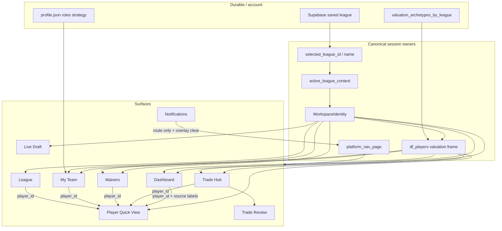
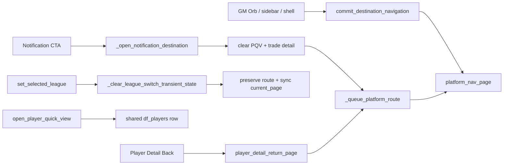

# Canonical Context Synchronization Audit

## Scope

Architecture audit and stale-state fixes only. Baseline `6abc42b` (post PR #130).

No football logic, rankings, valuations, Trust calculations, recommendation
generation/ordering, authentication, entitlements, Stripe, Supabase schema, or
caching contracts were changed.

## Verdict

FantasyGM Lab already had a single rerun pipeline for league identity and
valuation:

`resolve_active_league_context` → `WorkspaceIdentity` → one
`apply_active_valuation` frame → `get_shared_league_context` → route render.

Stale-state defects concentrated in **session hygiene asymmetries** and a few
competing owners. Those are corrected below. Remaining risks are documented
without inventing deep-link payloads the product does not yet store.

## Context dependency diagram

## State ownership table

| Concern | Canonical owner | Class | Notes |
|---|---|---|---|
| Active league | `selected_league_id` / `selected_league_name` | persistent | Written only by `set_selected_league` / resume |
| Resolved league+roster | `active_league_context` → `WorkspaceIdentity` | derived | Invalidated on every league change |
| Valuation lens | `league_type` + auto lens sentinel | persistent (session) | Auto-reset per league; overrides reset on switch |
| Scoring overrides | `league_*_override` keys | temporary | Reset to `Auto` on league change |
| Valuation archetype | `valuation_archetypes_by_league` | persistent map | League-keyed; retained across leagues |
| Player values | one `df_players` per rerun | derived | Built once in `main` |
| Route | `platform_nav_page` (+ synced `current_page` on switch) | route-local | Query param mirrors |
| Selected player (PQV) | `player_quick_view_*` | temporary | Cleared on league switch / notification route |
| Player detail page | `player_detail_*` | route-local | Cleared on league switch |
| Trade detail | `dg_trade_detail_*` | temporary | Closed on league switch / notification route |
| Trade Hub focus | `trade_hub_focus_*_{league_id}` | route-local | League-namespaced; prior league cleared on switch |
| Legacy Trade Hub handoff | `trade_hub_player_id` | temporary | Cleared on switch; migrated into scoped focus on Trade Hub entry |
| Role map | `role_map` | derived | Owned by My Team; cleared on league switch |
| Browsed franchise | `selected_team_roster_id` | route-local | League Overview only; cleared on switch |
| Notifications | demo items + `href_hint` | temporary | Route destination only |

## Navigation flow diagram

## Stale-context bugs fixed

1. **Sidebar / direct `set_selected_league` hygiene gap** — Now runs the same transient clear as the header switcher (player detail, PQV, trade detail, team browse, role map, overrides, legacy trade focus).
2. **`role_map` survived league switches** — Cleared so Trade Hub / PQV cannot label players with the prior league’s roles.
3. **Scoring overrides bled across leagues** — Reset to `Auto` on league change so the next league re-derives from detection + lens.
4. **`_open_home_command_route` unbound `selected_league_id`** — Reads `st.session_state["selected_league_id"]` so Dashboard → Trade Hub focus writes cannot NameError / skip.
5. **Feedback roster preferred browsed team** — Recommendation feedback and profile feedback prefer canonical `my_roster_id` from `active_league_context`.
6. **Dual Trade Hub handoff channels** — Live Draft writes both legacy and league-scoped keys; Trade Hub migrates legacy into scoped focus and pops the global key.
7. **Notification CTAs left overlays open** — `_open_notification_destination` clears PQV / trade detail / GM sheet before routing.
8. **League switch route sync** — Header switch now mirrors `current_page` with `platform_nav_page`.
9. **Username switch incomplete clear** — `load_leagues_for_username` uses the canonical transient clearer.

## Duplicate state removed / consolidated

| Removed / demoted | Replacement |
|---|---|
| Partial clears inside `set_selected_league` | Single `_clear_league_switch_transient_state` |
| Header-only transient clear | Canonical owner is `set_selected_league` |
| Orphan `trade_hub_player_id` after Trade Hub open | Consumed into `trade_hub_focus_player_id_{league}` |
| Profile feedback using `selected_team_roster_id` | Canonical `my_roster_id` |

## Remaining architectural risks

1. **Player Quick View narratives are independently derived** from roster heuristics / source notes, while Trade Hub explanations come from trade idea objects. Values share `df_players`; wording can still differ by design until PQV consumes a shared recommendation object.
2. **Notifications are route-only** — demo CTAs do not carry player/trade payloads, so deep-link fidelity beyond “correct page + clean overlays + active league” is not available yet.
3. **`valuation_archetypes_by_league` retains other leagues** intentionally; wrong-league reads would require a future bug, not current bleed.
4. **Global news cache** remains shared, then filtered by roster ownership at render — freshness TTL is provider-bound.
5. **Founder Ops** is operational tooling and is outside the franchise workspace identity contract.

## Validation

- `python scripts/audit_context_integrity.py`
- Regression tests in `tests/test_canonical_context_sync.py`
- compileall, full pytest, performance budget, Chromium / CI

## Rollback

Revert the merge commit on `main` (boundary: `6abc42b`).
