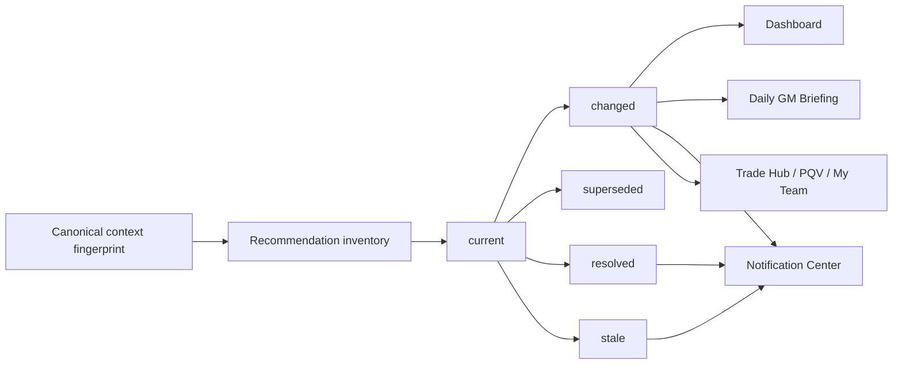

# Canonical Freshness, Change Detection & Recommendation Lifecycle

Presentation and lifecycle contract only. Does **not** change football logic,
valuations, rankings math, recommendation generation/scoring/ordering, Trust,
authentication, entitlements, Stripe, Supabase schema, or Sleeper semantics.

## Current-state audit

| Surface | Canonical owner | Provenance | Cache / session key | Freshness inputs | Invalidation triggers | Recompute triggers | Consumers |
| --- | --- | --- | --- | --- | --- | --- | --- |
| Dashboard recommendations | `dashboard_workflow.organize_dashboard_items` | Existing trade/waiver/need builders in `app.py` | Per-render tiles; `@st.cache_data` for provider payloads | League, roster, lens, scoring, roster players, provider season/settings | Lifecycle sync on context change | Dashboard render when inventory inputs change | Briefing, Notification Center, PQV via narrative bind |
| Trade Hub recommendations | Trade Hub builders + `canonical_recommendation_narrative` | Trade idea identity tuple | Session narrative bind | Same football context + package identity | `invalidate_stale_narrative`, lifecycle sync | Trade Hub render | Trade Review, PQV, notifications |
| My Team decisions | Roster decision narrative builder | Player + action + league | Session narrative bind | Roster ownership, lens | Lifecycle sync, roster version change | My Team render | PQV, Briefing watch rows |
| Waiver recommendations | `build_waiver_narrative` | Player + action + league (**not** reason prose) | Session narrative bind | Availability, lens, scoring | Lifecycle sync | Waivers / Dashboard render | Briefing, Notification Center |
| League Intelligence | Dashboard intelligence zone | Same as dashboard tiles | Dashboard frame | Dashboard inventory | Dashboard invalidation | Dashboard render | Briefing league-movement rows |
| Canonical recommendation narratives | `modules/canonical_recommendation_narrative.py` | Surface builders | `canonical_recommendation_narrative` session key | League, roster, lens, scoring | `invalidate_stale_narrative`, lifecycle sync | Surface bind on open | All consumer surfaces |
| Canonical player rankings | `canonical_player_ranking.attach_canonical_ranks` | Valuation table + scoring context | `_canonical_rank_context_key` | Lens, league settings, scoring format | Rank context key mismatch | Rank attach on data frame | PQV, cards, Briefing rank context |
| Daily GM Briefing | `daily_gm_briefing.compose_daily_gm_briefing` | Dashboard briefing only | `LIFECYCLE_BRIEFING_SIGNATURE_KEY` | Context fingerprint digest + inventory signatures | Context / inventory material change | Dashboard render | Dashboard Today's Game Plan |
| Notification Center | `notification_center.publish_activity_inventory` | Dashboard tiles | `activity_inbox_snapshot` + material signatures | Context fingerprint + per-rec material signature | League / lens / scoring / roster lifecycle sync | Dashboard publish after tiles built | Executive command bar inbox |
| Player Quick View recommendation context | `canonical_recommendation_narrative.resolve_narrative_for_player` | Bound narrative | Session narrative bind | Narrative context match | Narrative invalidation | PQV open | PQV panel |

### Root causes addressed in PR #149

1. No unified lifecycle fingerprint across narrative, inbox, briefing, and ranks.
2. `scoring_format` missing from narrative invalidation.
3. Inbox snapshot persisted across lens/scoring/roster changes (only league switch cleared it).
4. Waiver/roster IDs included `reason` prose → false "Recommendation updated" churn.
5. Briefing `freshness` was a static string (`dashboard_frame`), not context-derived.
6. Streamlit reruns could appear as new activity when signatures were not compared.

## Canonical context fingerprint

Built by `recommendation_lifecycle.build_context_fingerprint()` using **existing inputs only**:

| Input | Source |
| --- | --- |
| `account_scope` | Session account identity |
| `league_id` | Active league |
| `roster_id` | Active roster |
| `season` | `stats_season` / league settings |
| `week` | League settings when present |
| `scoring_format` | Resolved league scoring |
| `valuation_lens` | Active score field / lens |
| `roster_state_version` | Sorted roster player-id hash |
| `provider_data_version` | `league_value_settings_key` (+ season) |

**Excluded:** arbitrary timestamps, presentation state, card position, rerun counters.

Digest: SHA-256 of sorted JSON payload (32 hex chars).

Session key: `_canonical_lifecycle_context_fingerprint`.

## Recommendation identity contract

| Kind | Stable ID derivation | Notes |
| --- | --- | --- |
| Trade | `sha256(repr(trade_idea_identity_tuple))[:16]` | Partner, send/receive assets, scores, tag |
| Waiver | `waiver\|league\|player\|action` | Reason prose **excluded** (PR #149) |
| Roster decision | `roster\|league\|player\|action` | Reason prose **excluded** |
| Status tiles | `tile:{category}:{label}:{player}:{value}` fallback | When no canonical narrative id exists |

Same logical recommendation retains the same ID across equivalent recomputation.
Different actions or targets receive different IDs.

## Lifecycle states

Internal contract (`recommendation_lifecycle`):

| State | Meaning |
| --- | --- |
| `current` | Underlying context still matches |
| `changed` | Same recommendation id, material content changed |
| `superseded` | Newer canonical recommendation replaced it |
| `resolved` | Action no longer applicable |
| `stale` | Provenance/context mismatch; validity cannot be established |

Not exposed as user-facing status on every tile.

## Material-change rules

**Material (may emit lifecycle transition / notification):**

- Recommendation action, target, or package changes
- Meaningful confidence band change (High/Medium/Low)
- Roster ownership change (`roster_state_version`)
- Player availability / injury affecting output
- Ranking movement when bound to tile narrative fields
- Scoring format or valuation lens change
- Recommendation disappears
- New canonical #1 recommendation (`priority_changed`)

**Not material:**

- Streamlit rerun
- Page navigation
- Formatting / regenerated prose with identical material signature
- Timestamps and cache TTL refresh with identical values
- Insignificant floating-point display differences
- Card position from presentation rendering alone

Machine-readable reasons: `roster_changed`, `player_availability_changed`,
`valuation_context_changed`, `scoring_context_changed`, `recommendation_changed`,
`recommendation_resolved`, `priority_changed`.

## Invalidation matrix

| Event | Narrative | Inbox snapshot | Briefing signature | Rank columns |
| --- | --- | --- | --- | --- |
| League switch | Clear | Clear (`clear_notification_league_snapshot`) | Clear | Existing rank invalidation |
| Valuation lens switch | Clear | Clear (`clear_notification_context_snapshot`) | Clear | Existing |
| Scoring format switch | Clear | Clear | Clear | Existing `_canonical_rank_context_key` |
| Roster transaction | Context version change → sync | Clear when roster version changes | Clear | No rank recompute added |
| Identical rerun | Keep | Merge snapshot (preserve reads) | Keep | Keep |
| Logout / account switch | Clear | Clear | Clear | Cleared via session integrity |

## Daily GM Briefing behavior

- Composed only from existing Dashboard inventory (`compose_daily_gm_briefing`).
- `freshness` = canonical context fingerprint digest.
- `briefing_content_signature` detects material briefing changes.
- Unchanged context → identical briefing signature on rerun.
- Quiet day remains quiet when inventory is empty and context unchanged.
- Does not manufacture new items on rerun.

## Notification behavior

- `publish_activity_inventory` stores material signatures per recommendation id.
- Identical fingerprint + identical signatures → merge snapshot, preserve read state.
- Material inventory diff uses `compare_inventory_signatures`.
- Does not create duplicate unread activity for unchanged recommendations.
- Not every lifecycle transition becomes a notification automatically.

## Persistence boundary

**Founder Beta:** session-local only.

- `_canonical_lifecycle_context_fingerprint`
- `_canonical_lifecycle_inventory_signatures`
- `_canonical_lifecycle_briefing_signature`
- `_canonical_roster_state_version`
- Existing `activity_inbox_snapshot` and read-id map

No Supabase schema change. Durable cross-session history deferred until this
contract is trustworthy.

## Performance impact

Lifecycle work is O(n) over dashboard tiles with lightweight JSON hashing.
No duplicate Sleeper/Supabase calls, no second recommendation generation, no
second ranking computation. Fingerprint compare is cheaper than regenerating
underlying systems.

Measured via existing pytest + performance budget scripts; no protobuf regression
to PR #138 first-usable-screen contract.

## Known limitations

- Status tiles without canonical narrative ids still use `tile:` fallback identity.
- `week` may be empty when league settings omit it; season/settings key still anchors context.
- Cross-session lifecycle comparison requires future durable store (not in Founder Beta).
- Trade package identity omits valuation lens by design (package identity, not lens identity).

## Lifecycle diagram

## Explicit confirmation

No changes to: football logic, valuations, rankings, recommendation generation,
recommendation scoring, recommendation ordering, Trust, authentication rules,
entitlement rules, Stripe, Supabase schema, Sleeper semantics, or business rules.

Presentation lifecycle hardening and stable ID derivation only.
