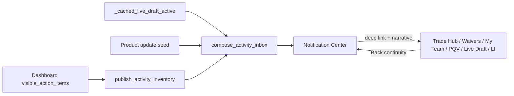

# Canonical Notification Center Contract

| Field | Value |
| --- | --- |
| Baseline | `3630b3c9c987b8ab214993a63bcadf6e8f89d59c` |
| Scope | In-app activity inbox composition, deep-link routing, session read state |
| Explicit non-changes | Football logic, valuations, rankings, recommendation generation/scoring/ordering, Trust, auth rules, entitlements rules, Stripe, Supabase schema, Sleeper semantics, caching contracts, business rules, push/email/SMS/APNs/FCM |

## Architecture

Notifications **summarize** already-approved Dashboard inventory and live-draft cache.
They do not call trade/waiver generators and do not invent football opinions.

## Notification model

`NotificationItem` fields:

| Field | Role |
| --- | --- |
| `id` / `notification_id` | Stable inbox identity |
| `category` | Trades / Waivers / League / Injuries / Live Draft / Product updates |
| `title` / `body` | Headline + one-line reason |
| `age_label` | Freshness label |
| `league_id` / `roster_id` | Active context provenance |
| `player_id` | Player deep link when present |
| `recommendation_id` / narrative | Canonical recommendation identity |
| `href_hint` / `focus_mode` | Destination route + Trade Hub focus |
| `unread` / `stale` / `stale_reason` | Inbox state |
| `provenance` / `source_kind` | `canonical` vs `product` |
| `entitlement_visibility` | `all` or `premium` (inventory already sliced upstream) |

## Canonical sources

1. **Dashboard `visible_action_items`** published via `publish_activity_inventory` after Dashboard computation (post first-usable route body).
2. **`_cached_live_draft_active`** for Live Draft presence (no Sleeper discovery on open).
3. **Product update** seed — clearly labeled `source_kind="product"`.

Empty / quiet inbox is valid when no league activity exists.

## Routing matrix

| Category / tile | Destination | Detail |
| --- | --- | --- |
| Top Trade Opportunity | `trade_hub` | `recommendation_id`, narrative bind, `route_player_id` focus |
| Top Waiver Opportunity | `waivers` | player focus when known |
| Injury / roster need with player | `player_quick_view` | exact player + narrative |
| Injury / roster without player | `my_team` | roster decision board |
| League / LI tiles | `rankings` | League Overview |
| Live Draft | `live_draft` | active draft context |
| Product update | none | informational only |

## Stale-state behavior

`validate_notification_for_open`:

- Other-league id → stale with switch guidance (no silent mismatched data)
- Missing recommendation in snapshot → `Recommendation updated`
- Live Draft inactive → `Draft has ended`
- Missing inventory for dashboard-sourced items → `No longer active`
- Stale items render without CTA and do not route

## Read / unread

- Session-local map keyed by `account_scope|league_id`
- Opening an item marks that id read; others unchanged
- Account logout / switch clears via `clear_notification_session_state`
- League switch clears inventory snapshot (no prior-league flash); read map is league-scoped
- **Limitation:** unread is not durable across browser sessions (no Supabase schema added)

## Briefing vs Notification

| | Today's Game Plan | Notification Center |
| --- | --- | --- |
| Job | Curated executive priorities (≤5) | Activity / history inbox |
| Source | Same Dashboard inventory zones | Same inventory + live draft + product |
| Presentation | Numbered morning brief | Category / headline / reason / CTA |
| Overlap | May share `recommendation_id` | Same id is an inbox record, not a second Dashboard card |

## Performance

- Inbox compose is O(n) over cached records (n ≤ 8)
- `publish_activity_inventory` runs inside Dashboard route body — **not** before first-usable paint
- Cold path with empty snapshot shows product-only / quiet copy without network or Trust work
- No new protobuf CSS on the global cold path beyond existing command-header styles

## Known limitations

1. Back from a notification handoff returns to Dashboard (Alerts live in the command bar popover; Streamlit cannot force-open the popover).
2. Unread state is session-local only.
3. League Intelligence news feed is not a separate source — only Dashboard inventory tiles.
4. Free vs Premium football truth is identical; Free already receives a shorter Dashboard inventory before publish.
