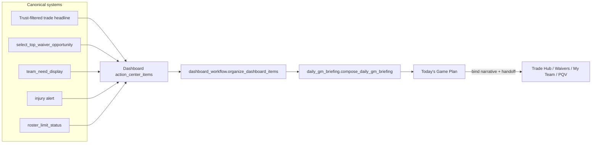

# Daily GM Briefing / Today's Game Plan Contract

| Field | Value |
| --- | --- |
| Baseline | `5f2a05acb3394696f02d196470fcabed72078ab0` |
| Scope | Composition / presentation orchestration only |
| Explicit non-changes | Football logic, valuations, rankings math, recommendation generation/scoring/ordering, Trust, auth rules, entitlements rules, Stripe, Supabase schema, Sleeper semantics, caching contracts, business rules |

## Architecture

The briefing never calls trade/waiver generators. It receives the already-organized
`DashboardBriefing` produced for the existing five-zone Dashboard.

## Canonical inputs

| Input | Owner | Role in briefing |
| --- | --- | --- |
| `DashboardBriefing.primary` | `organize_dashboard_items` | TOP PRIORITY |
| `DashboardBriefing.immediate` | same (injury / roster pressure) | WATCH |
| Need / startup status in `additional` | same | WATCH when present |
| Waiver tiles in intelligence/additional | same | WAIVER OPPORTUNITY |
| Remaining intelligence tiles | same | LEAGUE MOVEMENT |
| Tile `recommendation_id` / narrative | canonical narrative builders | Cross-surface identity |
| `player_row` ranks | existing row fields + `format_compact_rank` | Optional rank context |
| Entitlement slice | `visible_action_items[:4]` for Free | Inventory already sliced before organize |

## Ordering rules

**Forbidden:** `daily_briefing_score` or any new football priority formula.

**Derived order (presentation only):**

1. Primary recommendation from `organize_dashboard_items` → Top Priority  
2. Immediate watch labels (Injury Alert, Roster Pressure) → Watch  
3. Need / startup status remaining in additional → Watch  
4. First waiver opportunity among intelligence then additional → Waiver Opportunity  
5. Remaining intelligence (trade/waiver not already shown) → League Movement  

Cap: **5 items**. Categories are omitted when empty.

Quiet day: empty compose → “No move needed right now” with a short reason.

## Deduplication

Uses `recommendation_id` when present (same helper as `recommendation_lifecycle.item_recommendation_id`).

If primary trade id equals an intelligence trade id, intelligence is not repeated.

Headline+category fingerprints suppress duplicate id-less status tiles.

Does **not** suppress different actions that merely share a position.

## Entitlement behavior

Free vs Premium football truth is identical. Free already receives a shorter
`visible_action_items` list before organize; the briefing composes that list.
Premium CTA locks for “More next moves” remain in the existing Dashboard zones —
the briefing does not invent alternate advice.

## Lifecycle / invalidation

Briefing is **not** stored in session. It is recomposed each Dashboard render from
current `dashboard_briefing`. League switch, logout, account switch, lens/format
changes rebuild inventory via existing Dashboard + PR #145 session hygiene, so no
prior-account/league briefing can flash from a cached payload.

Opening an item binds the tile’s canonical narrative (when present) and pushes
workflow return with `handoff_source="daily_gm_briefing"`.

## Navigation

| Category | Default destination |
| --- | --- |
| Top Priority / League Movement with `route_key` | tile `route_key` (usually Trade Hub) |
| Waiver Opportunity | `waivers` (or tile route) |
| Watch (injury / pressure / need) | `my_team` |

Back uses existing `executive_workflow_return` continuity.

## Performance

Composition is O(n) over already-built tiles (n ≤ ~5–8). No new network calls,
Trust boards, or ranking recomputation. Does not move League Pulse or other
deferred work onto first-usable paint. First-usable shell remains before route
bodies as documented in `docs/cold-start-first-usable-screen.md`.

## Quiet day

Shown when organize yields no primary and no watch/waiver/intelligence items
(after entitlement slice). Copy is fixed and concise; no filler recommendations.

## Known limitations

1. League Intelligence **news feed** (`league_intelligence.py`) is not a source —
   only Dashboard inventory tiles.  
2. Notifications remain demo-only and are not composed into the briefing.  
3. My Team’s separate primary selector is not a second orderer; Dashboard order wins.  
4. Rank context appears only when `player_row` already carries ranks.  
5. Free inventory truncation happens upstream; the briefing does not re-slice.

## Rollback

Revert the merge commit introducing this contract.
