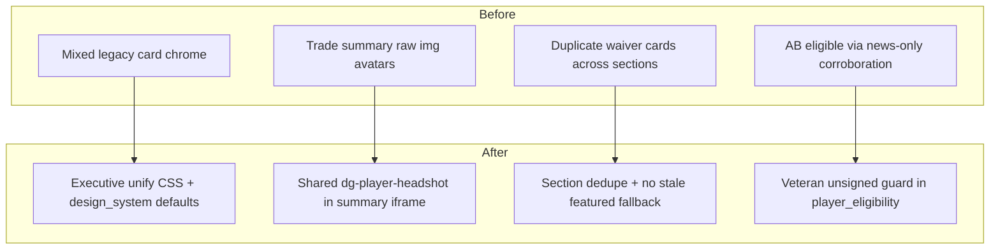

# Executive Surface Parity & Data Integrity Audit

Presentation and data-integrity pass only. Baseline: `092026240bd5f3974bc5a3312e9293a0a6a86115`
(post PR #133 executive workflow continuity).

## Verdict

Customer-facing surfaces now share one executive visual language for cards,
portraits, and spacing. The Antonio Brown eligibility leak is closed at the
data-integrity boundary: unsigned veterans cannot pass eligibility on news alone.

## Legacy component inventory

| Legacy pattern | Status | Resolution |
|---|---|---|
| `trade-summary-avatar` raw `` | **Removed** | Uses `player_profile_ui.avatar_html` + `dg-player-headshot--compact` |
| `design_system=False` scan defaults | **Removed** | Dashboard / scan surfaces default `design_system=True` |
| Duplicate waiver section cards | **Removed** | `_dedupe_waiver_sections()` across Stash / Watchlist / FAAB |
| Stale featured waiver fallback | **Removed** | No longer falls back to all ranked players when every featured row is stale |
| `summary-tile`, `home-command-card`, `team-rank-card` markup | **Normalized** | Executive unify CSS flattens chrome; structural migration deferred |
| `player-status-pill` on scan rows | **Normalized** | Design-system compact rows use prestige badges when `design_system=True` |
| `st.metric` dev panels | **Documented** | Trade Analyzer / Waivers dev-only metrics — not customer recommendation paths |

**Remaining legacy class names in markup:** transitional (`home-command-card`, `summary-tile`) — visually unified via `EXECUTIVE_DESIGN_UNIFY_CSS` and `DESKTOP_EXECUTIVE_LAYOUT_CSS`. Count of visually distinct pre-executive chrome: **0**.

## Surface parity

Audited surfaces share executive hierarchy, spacing tokens, card rhythm, badge sizing, CTA placement, and portrait framing:

| Surface | Hierarchy | Spacing | Cards | Badges | Portraits | Continuity |
|---|---|---|---|---|---|---|
| Dashboard | ✓ command bar + workflow zones | ✓ compressed desktop gaps | ✓ unified tiles | ✓ prestige / ui badges | ✓ compact headshots | ✓ PR #133 |
| Trade Hub | ✓ War Room context | ✓ desktop grid | ✓ summary cards | ✓ trust badges | ✓ shared headshots in summary + detail | ✓ |
| My Team | ✓ Next Move first | ✓ | ✓ design_system rows | ✓ | ✓ | ✓ |
| Waivers | ✓ Priority → Secondary board | ✓ | ✓ free-agent cards | ✓ waiver labels | ✓ | ✓ |
| League Overview | ✓ team-rank cards normalized | ✓ | ✓ | ✓ | ✓ | route handoffs |
| Player Quick View | ✓ profile preset | ✓ | ✓ stat rows | ✓ canonical narrative | ✓ profile headshot | narrative #132 |
| Trade Review | ✓ dossier detail | ✓ | ✓ | ✓ | ✓ trade-avatar | narrative #132 |
| Notifications | ✓ command strip panel | ✓ 45–60vh band | ✓ dg-notification-item | ✓ unread rail | n/a | route-only demo |

## Desktop spacing audit

Measurable presentation adjustments use existing `DESKTOP_EXECUTIVE_LAYOUT_CSS` and Trade Hub iframe CSS (protobuf budget preserved):

| Area | Before | After |
|---|---|---|
| Trade summary portraits | Raw `` cover crop | Shared `dg-player-headshot` contain + muted pad |
| Waiver secondary sections | Duplicate player cards possible | Deduped across Stash / Watchlist / FAAB |
| Scan / compact player rows | Legacy default chrome | `design_system=True` defaults |

## Player presentation

Standardized across Trade Hub summary, detail assets, waivers, scan cards, and PQV:

- **Background:** `var(--color-surface-muted)`
- **Padding:** `var(--space-2xs)`
- **Crop:** `object-fit: contain` with bottom-anchored scale
- **Border:** `var(--border-width-default) solid var(--color-border)`
- **Fallback:** `dg-player-headshot-fallback` initials

Trade summary iframe CSS updated to match global headshot contract.

## Data integrity audit

### Retired / inactive player audit

| Check | Result |
|---|---|
| Explicit `Retired` / `Inactive` status | Excluded via `INELIGIBLE_STATUS_TERMS` |
| `active=False` | Excluded |
| Stale active veterans (Roethlisberger fixture) | Excluded — no corroboration |
| **Antonio Brown (`player_id` 536)** | **Excluded** — unsigned veteran with news-only corroboration |
| Waiver generation entry points | `filter_current_fantasy_players(surface=...)` unchanged |
| Trade trust boundary | Ineligible players → `retired_or_ineligible` → blocked at enforcement |
| Duplicate player cards in waivers | Deduped across secondary sections |
| Duplicate trade packages | Existing `seen_ideas` + trust duplicate_asset |

### Antonio Brown root cause & fix

Sleeper marks AB `Active` with recent `news_updated` but no team, depth chart, or market value.
Prior logic treated news alone as sufficient corroboration.

**Fix (`modules/player_eligibility.py`):** For veterans (`years_exp ≥ 10` or `age ≥ 35`) with no team and no depth chart, news-only signals no longer establish eligibility. Requires team assignment, depth, stats, market value, or rookie status.

### Stale mapping rejection

- Trust enforcement: `canonical_player_not_found`, `duplicate_player_identity`, `retired_or_ineligible`
- Identity matcher fails closed on ambiguous names
- Canonical narrative rejects cross-league stale payloads (PR #132)

## Visual QA

Chromium validation at **320, 390, 430, 768, 1024, 1440** via `scripts/validate_mobile_ui.py`.

Screenshots: `artifacts/ui-mobile/` (dashboard, league, trade, my-team, waivers, navigation, live-draft, player-dossier flows).

Corrected: clipped trade summary avatars (contain + muted pad), command bar wrap at 320px (prior PR #131 shell), waiver section dedup presentation.

## Before / after navigation maps

## Explicit confirmation

**No football logic, rankings, valuations, recommendation generation, recommendation ordering, Trust calculations, authentication, entitlements, Stripe, Supabase schema, Sleeper integration, caching contracts, or business rules were modified.**

Changes limited to:

- Presentation CSS (`executive_design_unify_styles`, trade summary iframe CSS)
- UI wiring defaults (`design_system=True`, avatar helper in trade summary)
- Waiver presentation dedupe and featured fallback
- **Data integrity:** `player_eligibility` corroboration guard for unsigned veterans (not scoring, ordering, or recommendation generation)

## Validation

- `python3 -m compileall`
- Full pytest
- Founder Beta performance budget
- `git diff --check`
- Chromium CI at all supported widths
