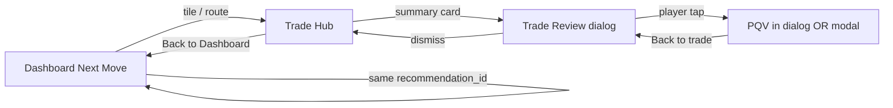
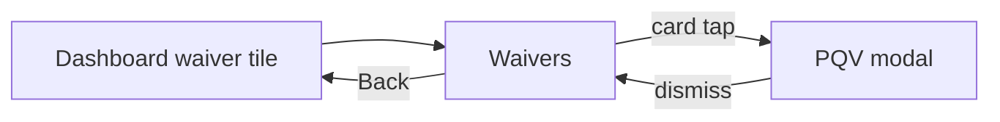
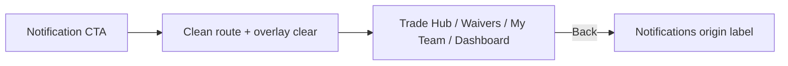
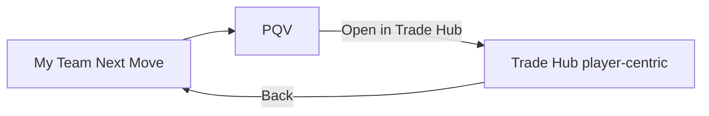

# Executive Workflow Continuity Audit

Presentation and workflow integrity only. Baseline: `67350fad839ecde1736390550e22363b78412593`
(post PR #132 canonical recommendation narrative).

No football logic, valuations, rankings, recommendation generation/ordering, Trust
calculations, authentication, entitlements, Stripe, Supabase schema, Sleeper
integration, caching contracts, or business rules were changed.

## Verdict

FantasyGM Lab already shared one league identity, valuation frame, and canonical
recommendation narrative (PR #132). The remaining friction was **workflow
continuity**: handoffs wrote focus keys and narrative provenance but did not
always tell the user where they came from, how to return, or restore scroll
position. This pass adds a lightweight return stack, scroll restore on Back, and
continuity banners on Trade Hub / Waivers / My Team.

## Workflow journeys traced

### Dashboard → Trade Hub → Trade Review → PQV → Back → Dashboard

| Step | State preserved | Narrative |
|---|---|---|
| Dashboard tile → Trade Hub | `trade_hub_focus_*`, `recommendation_narrative`, return stack | Same canonical trade narrative |
| Trade Hub card → Review | `dg_trade_detail_*`, bound narrative | Same idea identity digest |
| Review → PQV (in dialog) | `trade_detail_navigation`, narrative payload | Same reason/action/confidence |
| Review Back | trade detail view, expanded package | Same trade key |
| Hub Back | scroll restore, league, lens, narrative | Same recommendation record |

### Dashboard → Waivers → PQV → Back

Waiver opens bind `build_waiver_narrative` for PQV. Return stack records Dashboard
origin when the tile uses `_open_home_command_route`.

### Notification → surface → (future player/trade deep link)

Demo notifications remain route-only (no player/trade payload). Overlays
(PQV, trade detail) are cleared before routing.

### My Team → Recommendation → PQV → Trade Hub → Return

PQV “Open in Trade Hub” captures Player Quick View as return origin.

### Live Draft → Trade Hub

Rank board handoff writes league-scoped focus and return stack (`live_draft`).

## Before navigation map

| Transition | Before | Gap |
|---|---|---|
| Dashboard → Trade Hub | Focus player + source keys written | **Source note never shown**; no Back |
| Trade Hub → Review → PQV | Narrative bound in #132 | Back-to-trade OK; no page-level return |
| Sidebar → any page | Scroll reset to top | Expected for explicit nav |
| Back (conceptual) | Same as sidebar re-click | **Scroll lost**; no return stack |
| League switch | Transient clear incl. narrative | Return stack not cleared (fixed) |
| Notification → page | Overlay clear + route | No origin breadcrumb |

## After navigation map

| Transition | After |
|---|---|
| Dashboard / Live Draft / Notification / PQV → destination | `executive_workflow_return` pushed with origin label, note, league, `recommendation_id` |
| Trade Hub / Waivers / My Team | Continuity banner: `Origin → Current` + next-action hint + **← Back** |
| Back button | `request_scroll_restore` + `platform_nav_page` restore; narrative + league preserved |
| All pages | Scroll tracker persists Y in `sessionStorage` scoped by league |
| League switch | `clear_return_context` with other transient state |

## Cross-page state preserved

| State | Owner | Cleared on |
|---|---|---|
| `executive_workflow_return` | `workflow_continuity` | Back, league switch |
| `canonical_recommendation_narrative` | PR #132 | PQV close, league switch, orphan open |
| `trade_hub_focus_*` | league-scoped keys | league switch |
| `dg_trade_detail_*` | `trade_detail_navigation` | dismiss, league switch, notification route |
| `platform_nav_page` | shell | explicit nav only |
| Scroll Y | browser `sessionStorage` | new league scope |
| Valuation lens / league | `WorkspaceIdentity` | league switch (canonical sync) |

## Dead ends removed

1. **Trade Hub after Dashboard handoff** — user saw a cold board with no trail; now sees continuity banner + Back.
2. **Waivers / My Team after cross-surface handoff** — same banner when return context exists.
3. **Back navigation scroll dump** — Back restores saved scroll instead of resetting to generic top.

## Duplicate transitions removed / avoided

| Pattern | Resolution |
|---|---|
| Sidebar re-click vs Back | Back uses restore mode; sidebar still resets (intentional explicit nav) |
| `trade_hub_home_source_*` write-only | Now consumed in Trade Hub continuity banner note |
| Workspace handoff without return | `render_workspace_handoff` pushes return context before commit |

No redundant confirmation screens were added. Trade Hub + Trade Analyzer dual
handoff on My Team **retained** — distinct destinations, not duplicate hops.

## Decision momentum (presentation-only)

| Goal | Clicks (typical) | Notes |
|---|---|---|
| Best trade | Dashboard tile → Hub card → Review | 2–3; focus player pre-loaded from tile |
| Best waiver | Dashboard tile → Waiver card → PQV | 2–3; narrative bound on open |
| Best roster move | My Team Next Move tile | 1; primary recommendation surfaced inline |
| Player evaluation | Any card → PQV | 1; neutral vs active recommendation distinguished (#132) |

No recommendation ordering, Trust, or generation logic changed.

## Remaining workflow friction

1. **Notifications** — route-only demos; no player/trade payload for true deep link continuity.
2. **Sidebar navigation** — still scroll-resets (explicit global nav, not workflow Back).
3. **Trade Analyzer vs Trade Hub** — both reachable from My Team; intentional dual path.
4. **Founder Ops** — operational surface; outside franchise workflow contract.
5. **Expanded section state** — Streamlit expanders do not persist across route changes (framework limit).

## Future opportunities

1. Bind notification payloads to `recommendation_id` when live events ship.
2. Persist Trade Hub “show more” count in league-scoped session for return visits.
3. Single “Continue recommendation” CTA on Dashboard that reopens last bound narrative anywhere.
4. Breadcrumb in executive command bar (mobile) mirroring desktop continuity banner.

## Implementation map

| Module | Role |
|---|---|
| `modules/workflow_continuity.py` | Return stack, banner HTML, next-action hints |
| `modules/navigation_state.py` | `request_scroll_restore`, scroll storage scope |
| `app.py` | Handoff capture, Back callback, banners, scroll component restore mode |
| `modules/executive_workflow_compression_styles.py` | `.dg-workflow-continuity` styles |

## Validation

- `python3 -m compileall`
- Full pytest (incl. `tests/test_executive_workflow_continuity.py`)
- Founder Beta performance budget
- `git diff --check`
- Chromium widths 320–1440: Dashboard, Trade Hub, Trade Review, My Team, Waivers, PQV, Notifications, Live Draft, Founder Ops
- CI Delivery Validation

## Rollback

Revert merge commit on `main`. Boundary: `67350fad839ecde1736390550e22363b78412593`.
