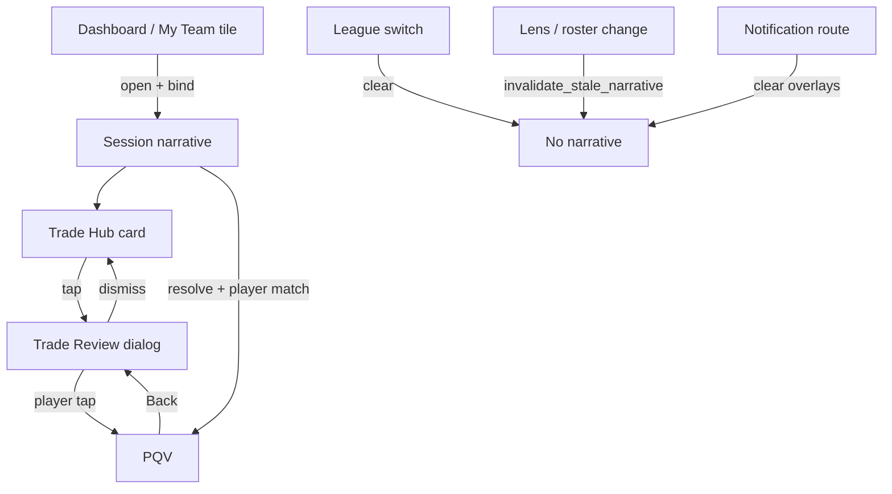

# Recommendation Correctness & Decision Quality Audit

Product-quality audit only. Baseline: `f1559fcbe7de4abe42ff973fe94d15e3a0bea2cf`
(post PR #134 executive surface parity).

Preserves canonical narrative (#132), context synchronization (#131),
workflow continuity (#133), and executive surface parity (#134).

## Verdict

Recommendations now stay coherent across surfaces: bound narratives expire when
league, roster, or valuation lens changes; duplicate executive tiles are
suppressed; My Team roster scan cards attach roster-decision provenance to PQV;
tile notes prefer the canonical reason instead of parallel rationale strings.

## Cross-surface recommendation consistency

| Surface pair | Consistency mechanism | Status |
|---|---|---|
| Dashboard ↔ Trade Hub | Same `build_trade_narrative` fields from headline idea | ✓ |
| Dashboard ↔ My Team | Shared trade/waiver narrative builders | ✓ |
| Trade Hub ↔ Trade Review | `bind_narrative` on card open; same `recommendation_id` | ✓ |
| Trade Review ↔ PQV | `resolve_narrative_for_player` + roster/lens guard | ✓ improved |
| Waivers ↔ PQV | `build_waiver_narrative` on board open | ✓ |
| Notifications | Route-only demo; clears overlays before navigation | ✓ documented |
| League Intelligence ↔ PQV | Neutral player context (no synthetic action) | ✓ by design |

### Intentional divergence (documented, not bugs)

- **Dashboard primary vs My Team Next Move** use different prioritization rules
  (`organize_dashboard_items` phase order vs `select_my_team_primary_recommendation`).
  Both now share canonical narrative text when the source is trade/waiver.
- **Headline trade selectors** differ under acute injury (`_headline_trade_idea` vs
  dashboard `[0]` vs Trade Hub ordered list). Ordering algorithms unchanged; narratives
  derive from the idea actually shown on each surface.

## Duplicate recommendation inventory

| Duplicate pattern | Resolution |
|---|---|
| Dashboard intelligence tile repeats primary trade | `suppress_duplicate_intelligence()` by `recommendation_id` |
| Additional moves repeat primary | `dedupe_executive_items()` |
| Waiver secondary sections (PR #134) | Cross-section player dedupe |
| Parallel `franchise_trade_summary.rationale` on tiles | Tiles prefer canonical `reason` via `consumer_fields` |
| Dual truncation paths | Single canonical reason before `concise_recommendation_text` |

## Recommendation lifecycle

### Freshness triggers

| Event | Behavior |
|---|---|
| League switch | `clear_narrative` (existing) |
| PQV close | `clear_narrative` (existing) |
| Valuation lens change | **New:** invalidate when bound lens ≠ active lens |
| Roster change | **New:** invalidate when bound roster ≠ active roster |
| Player not in bound package | PQV → neutral player context |
| Stale bound narrative after navigation | Cleared at page-ready via `invalidate_stale_narrative` |

## Executive prioritization audit

Presentation-only findings (algorithms unchanged):

| Question | Finding |
|---|---|
| First viewport answers "what first?" | Dashboard **Your Next Move** remains first zone |
| Injury before optimization? | **Immediate Action** (Roster Pressure / Injury Alert) follows primary when active |
| Low-impact displacing urgent? | Roster limit forces limit-first Next Move on My Team |
| Duplicate trade noise? | Intelligence trade tile suppressed when same as primary |

## Narrative redundancy report

| Issue | Fix |
|---|---|
| Long waiver confidence boilerplate | Shortened to `"{label} waiver confidence."` |
| Tile note + narrative reason drift | `render_home_command_tiles` uses canonical reason when present |
| My Team scan PQV without provenance | `build_roster_decision_narrative` on trade/hold/drop scan cards |
| Repeated risk in PQV | Existing `pqv_presentation` prefers risk OR confidence, not both |

## Before / after presentation changes

- Dashboard League Intelligence no longer repeats the same trade package already shown in Your Next Move when `recommendation_id` matches.
- PQV no longer shows a stale trade/waiver story after switching valuation lens or roster within the same session.
- My Team Trade/Hold/Drop scan cards open PQV with matching roster-decision narrative instead of neutral-only context.

## Explicit confirmation

**No football logic, rankings, valuations, recommendation generation, recommendation scoring, recommendation ordering, Trust calculations, authentication, entitlements, Stripe, Supabase schema, Sleeper integration, caching contracts, workflow architecture, or business rules were modified.**

Changes limited to:

- `modules/recommendation_lifecycle.py` (presentation provenance helpers)
- Narrative resolve / invalidate guards (`canonical_recommendation_narrative`, `app.py`)
- Dashboard dedupe (`dashboard_workflow.py`)
- Tile note alignment (`workspace_ui.py`)
- My Team PQV provenance (`my_team_ui.py`, `player_cards.py`)
- Waiver confidence wording compaction

## Validation

- Full pytest
- Founder Beta performance budget
- Chromium widths 320–1440
- CI green
