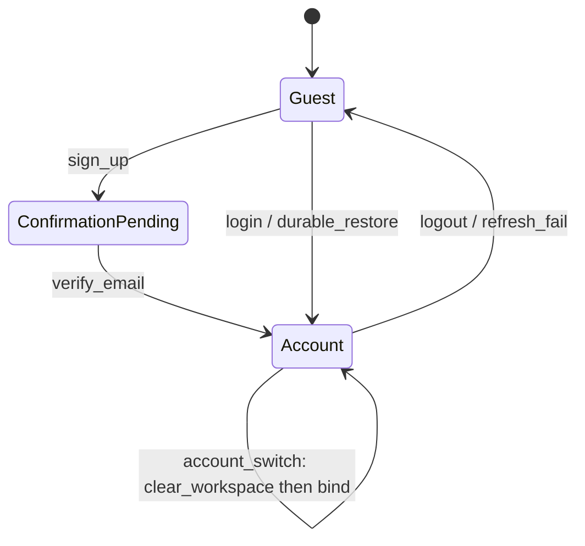
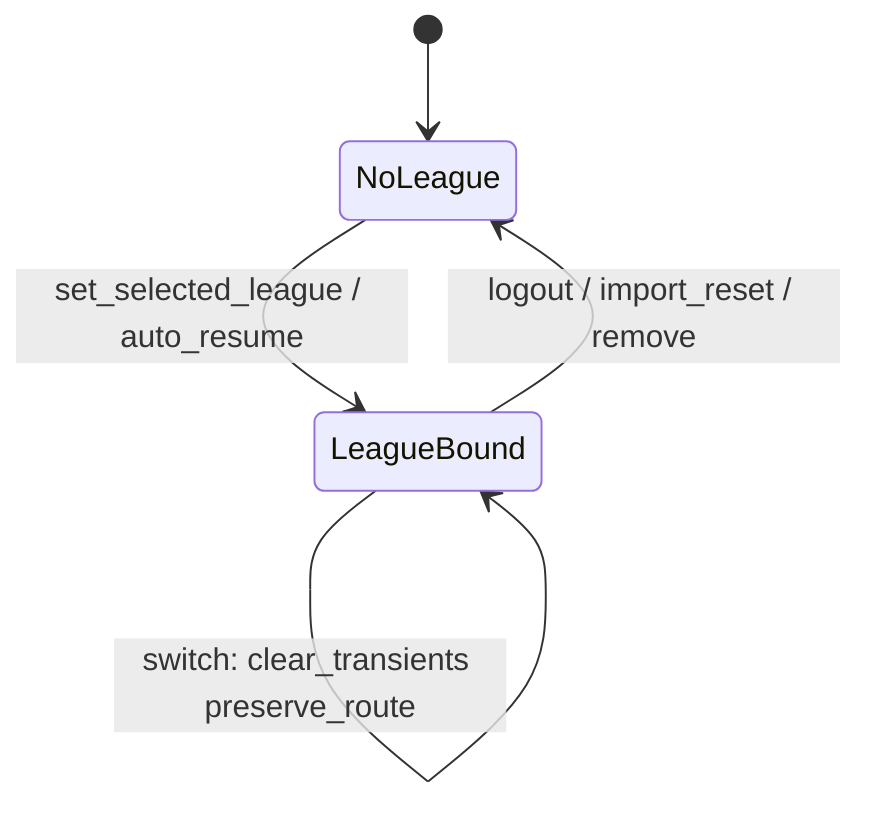
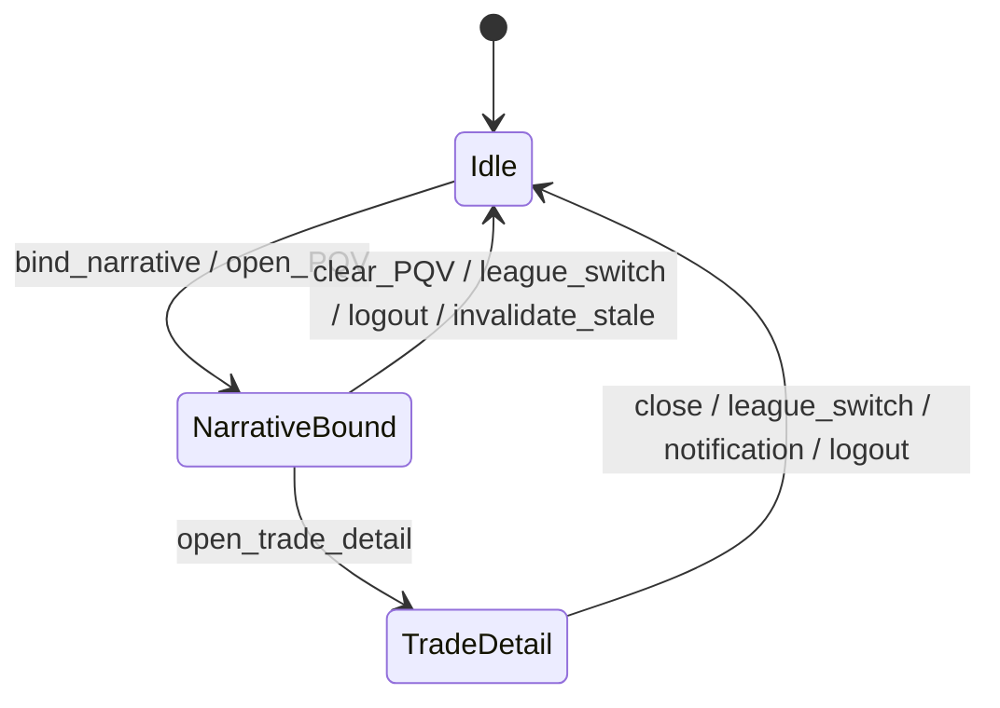
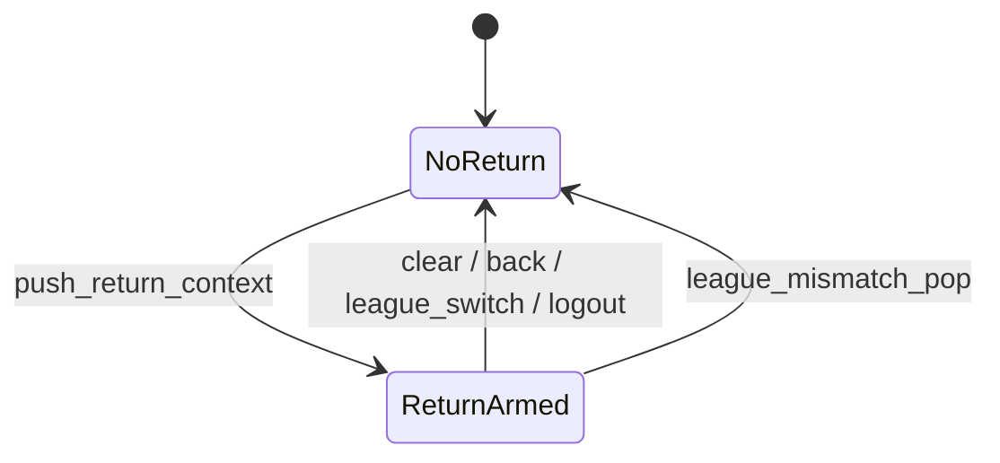
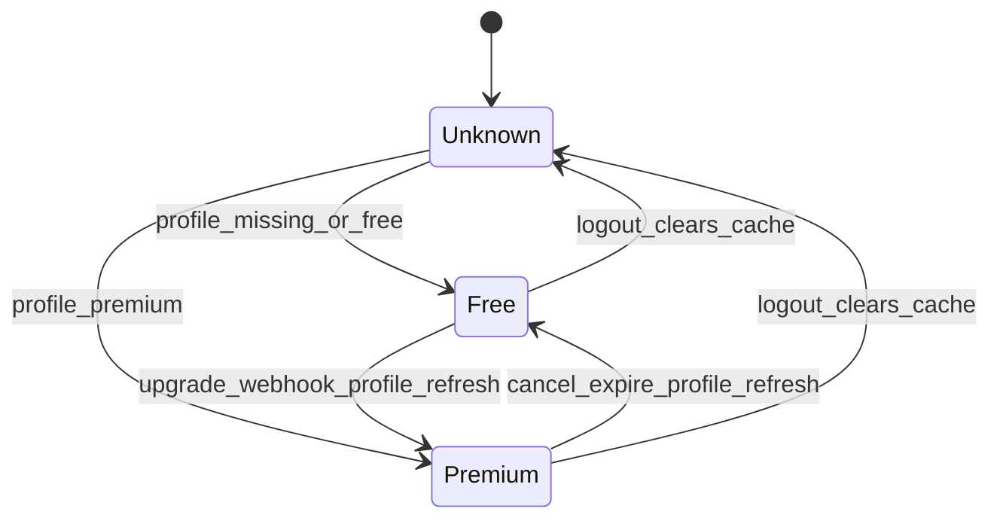
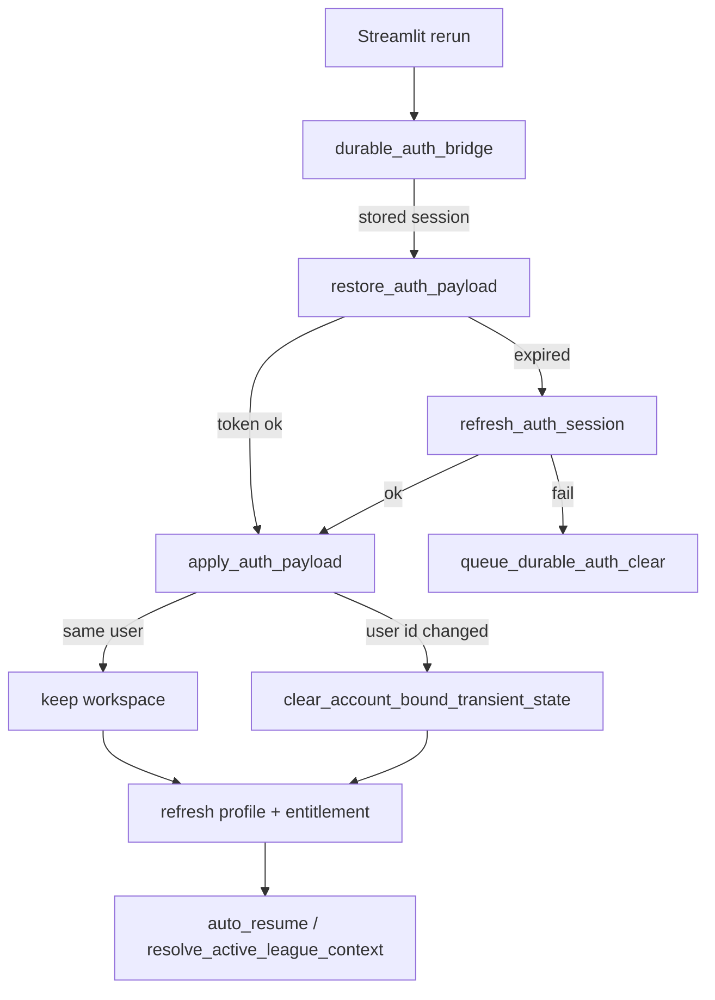

# Production State Transition & Session Integrity Audit

| Field | Value |
| --- | --- |
| Baseline | `7dd355db4829e9252e712becb1a595be017a7298` (`main` at PR #145 open) |
| Scope | Audit + state-correctness hardening only |
| Explicit non-changes | Football logic, rankings, valuations, recommendation generation/ordering, Trust, Sleeper logic, trade/waiver engines, Stripe, Supabase schema, authentication rules, entitlement rules, business rules |

## Verdict

Session ownership was already centralized for league switch (PR #130 era). Gaps concentrated in **logout / account-switch hygiene** and one **Trade Analyzer cross-league leak**. Those are fixed. Remaining risks are documented; no new product behavior was invented.

## Bugs fixed

1. **Logout left overlays** — PQV, Trade Detail, recommendation narrative, workflow return, Trade Analyzer package, `_identity_established`, `_effective_entitlement`, and Trade Hub namespaces survived `clear_auth_session`, so guest mode could show prior-account chrome.
2. **Account switch (apply_auth_payload)** — logging in as a different user (or guest→account) did not drop the prior workspace; now clears when `user_id` changes.
3. **Trade Analyzer on league switch** — send/receive packages cleared only when valuation fingerprint changed; identical settings across leagues revived the prior package. League switch now always clears the package.
4. **Workflow return league mismatch** — `current_return_context` returned `None` but left the stale payload in session; mismatch now pops the key.

## State ownership

| Domain | Owner | Session keys (canonical) |
| --- | --- | --- |
| Auth | `modules/auth_supabase.py` | `auth_user`, `auth_session`, `auth_email`, `account_mode`, durable bridge pending keys |
| Profile / entitlement cache | `app._refresh_supabase_account_profile`, `refresh_current_user_entitlement` | `account_profile*`, `_effective_entitlement` |
| League selection | `app.set_selected_league`, `resolve_active_league_context` | `selected_league_id/name`, `active_league_context`, `_league_*` |
| Recommendation narrative | `canonical_recommendation_narrative` | `canonical_recommendation_narrative` |
| Workflow return | `workflow_continuity` | `executive_workflow_return` |
| PQV / Trade Detail | `app` / `trade_detail_navigation` | `player_quick_view_*`, `dg_trade_detail_*` |
| Account-bound cleanup | `modules/session_integrity.py` | see inventory below |
| Notifications | presentation-only | no durable inbox keys; routing clears overlays |

## Complete transition matrix

| From → To | Cleanup | Restore | Invalid if |
| --- | --- | --- | --- |
| Guest → Sign up / Login | `apply_auth_payload` clears prior workspace when user id appears | Durable auth save queued | Confirmation required |
| Login → Verify email | Confirmation keys set | — | Access without confirm |
| First login → Import / Resume | Startup coordinator reset; saved leagues cache popped | Auto-resume saved league | Profile missing |
| Authenticated → Logout | `clear_auth_session` + `clear_account_bound_transient_state` | Guest mode | — |
| Logout → Login again | Same as guest→login | Durable restore + profile | Expired refresh |
| Browser refresh | Durable bridge `restore_auth_payload` | Same user keeps workspace | Expired JWT + failed refresh → durable clear |
| Session expiration (restore path) | Refresh failure queues durable clear | — | Mid-session JWT not continuously swept |
| League A → B | `_clear_league_switch_transient_state` + Trade Analyzer clear | Route preserved | — |
| League → No leagues | Selection cleared via import reset / empty lookup | Onboarding | — |
| Free ↔ Premium | Profile force refresh on Premium page; `_effective_entitlement` recomputed | Cache overwritten | Stale cache until refresh (logout now clears) |
| Open rec → PQV → Trade → switch league | Narrative + PQV + detail + return cleared | — | Stale narrative invalidated by `recommendation_lifecycle` |
| Notification CTA | PQV + Trade Detail + sheet cleared; handoff + route | — | — |
| Multi-tab | Streamlit session is per-tab; durable auth is shared browser storage | Restore on focus | Tab A logout clears durable; Tab B sees clear on next bridge read |

## State machines

### Authentication

### League

### Recommendation / overlays

### Workflow continuity

### Entitlement

### Session restoration

## Session-key inventory

### Cleared on logout (`clear_auth_session` + `session_integrity`)

Auth trio, profile/settings, league chrome (`selected_league_*`, `active_league_context`, `username`, platforms), `_league_*`, `_supabase_profile_loaded_*`, `_supabase_user_settings_loaded_*`, plus `ACCOUNT_BOUND_TRANSIENT_KEYS`, Trade Analyzer package, all Trade Hub namespaces, workspace cache prefixes (live draft / draft assistant / untouchables / roster news / deferred / dossier / dashboard orientation).

### Cleared on league switch

`LEAGUE_SWITCH_TRANSIENT_STATE_KEYS`, PQV, workflow return, Trade Detail, prior league Trade Hub focus, scoring overrides → Auto, **Trade Analyzer package** (new).

### Intentionally preserved across league switch

`platform_nav_page` (route continuity), `valuation_archetypes_by_league` (keyed map), durable auth, account profile.

### Intentionally preserved across same-user restore / refresh

League selection, overlays only if not account-switched, nav page.

### Remaining long-lived / widget keys

Streamlit widget keys (`desktop_nav_*`, expanders, etc.), `platform_nav_page` after logout (surfaces empty/lock correctly), `valuation_archetypes_by_league` map entries for other leagues, `league_value_settings` / `league_type` sidebar prefs (not league-roster state).

## Failure recovery (observed contracts)

| Failure | Recovery |
| --- | --- |
| Sleeper unavailable | League lookup status / captions; no silent wrong league |
| Supabase timeout | Profile error keys; entitlement falls Free via `premium.effective_entitlement` |
| Expired JWT | Restore-time refresh; failure queues durable clear |
| Profile missing | Free entitlement; Premium locks |
| League deleted | Selection clear / empty leagues list |
| Recommendation missing | Narrative invalidate / clear |
| Premium / webhook unavailable | Cached entitlement until refresh; Premium page forces refresh |

## Remaining risks

1. **Mid-session JWT expiry** is not continuously policed—only on durable restore. API failures may surface before the next restore pass.
2. **Multi-tab** shares durable browser auth but not Streamlit `session_state`; Tab B can briefly show stale in-memory UI until the bridge runs.
3. **Widget keys** are not fully enumerated for purge (Streamlit-owned); functional state is covered by explicit keys above.
4. **Account deletion** is not a first-class in-app flow in this repo; no dedicated purge path beyond logout.
5. **`platform_nav_page` after logout** is not forced to Dashboard; empty/locked surfaces are acceptable.

## Recommended simplifications (not done here)

- Single `WorkspaceSession` facade owning league + overlay + narrative keys.
- Continuous access-token skew check on each rerun.
- League-id namespace all Trade Analyzer package keys.

## Validation

- `compileall`, full `pytest`, performance budget, `git diff --check`
- Geometry / Chromium unchanged (presentation layout out of scope)
- CI Delivery Validation

## Rollback

Revert the merge commit introducing this audit.
